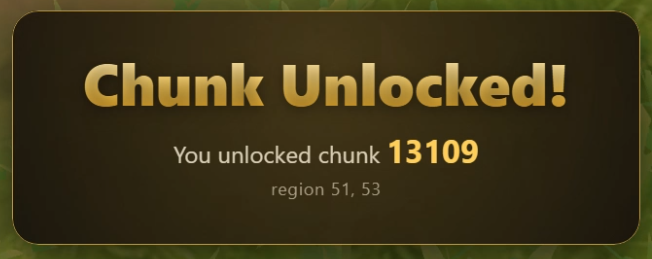
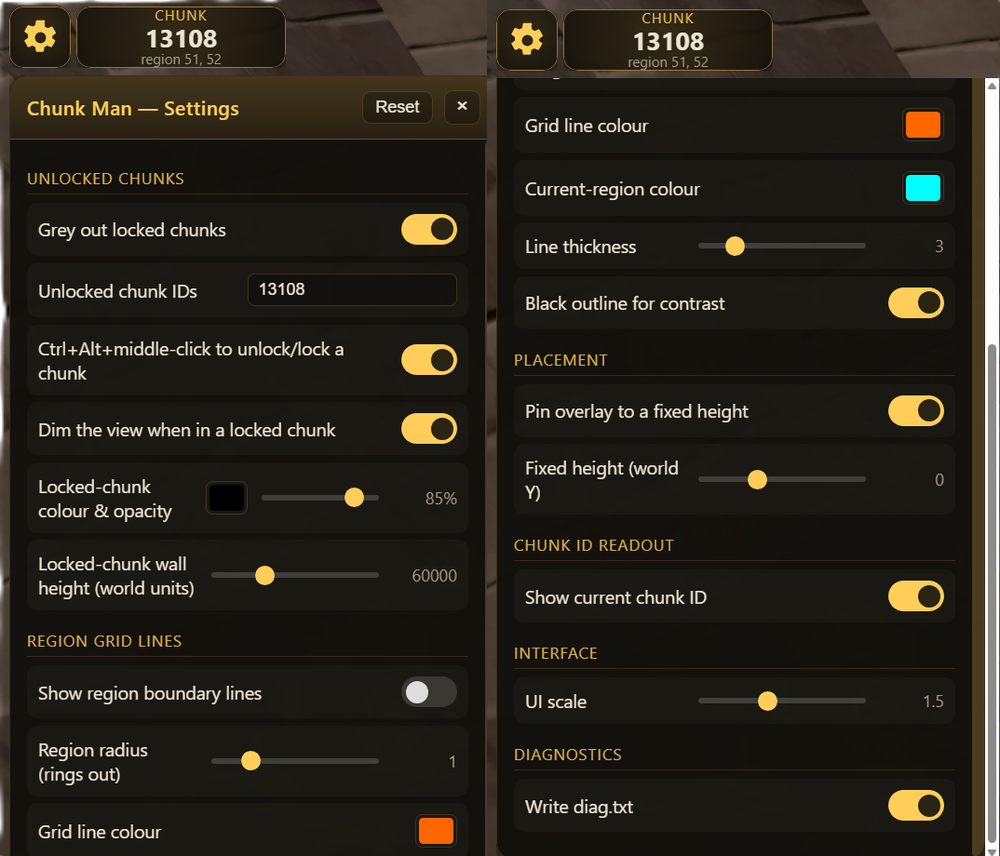

# bolt-chunkman

A **Chunk Man** plugin for the [Bolt Launcher](https://codeberg.org/Adamcake/Bolt) for RuneScape 3.
This plugin draws the chunk grid directly onto the game world so you can see
exactly where the boundaries are, greys out everything you haven't unlocked yet, and lets
you unlock new chunks with a single click (`Ctrl + Alt + middle-click`).

Bolt Launcher Install URL, see the [Installation](#installation) section below as well for how to use the URL and first use info:
```
https://codeberg.org/maplescaper/bolt-chunkman/releases/download/latest/meta.json
```

<video src="https://codeberg.org/maplescaper/bolt-chunkman/media/branch/main/images/chunkman-gif.webm" controls width="100%"></video>
> Use `Ctrl + Alt + middle-click` to unlock/lock chunks.
> If the video above doesn't play inline, [download / open `chunkman-gif.webm`](images/chunkman-gif.webm).


## Features

- **Region / chunk grid overlay**: draws the RuneScape map-square grid (64×64 tiles per
  region) on the ground around you.
- **Grey out locked chunks**: everything outside your list of unlocked chunks is walled
  off with vertical "curtains" along the frontier of your unlocked area. Contiguous unlocked
  chunks stay fully clear inside; only the outer perimeter is curtained.
- **Click to unlock**: `Ctrl + Alt + middle-click` any chunk on the ground to toggle it
  in or out of your unlocked list. Unlocking a new chunk pops a celebratory card:

  

- **Locked-view dimming**: if you wander into a chunk you haven't unlocked, the whole view
  dims so it's obvious you've stepped out of bounds.
- **Chunk ID readout**: a small badge shows the ID of the chunk you're currently standing
  in.
- **Settings panel**: a gear icon at the top-left of the screen opens an in-game
  settings panel. Most settings apply instantly, but others may need a client restart.

## Installation

To use this plugin, first install the Bolt Launcher. After that, when you first open it, go to the cog icon
at the top-right and navigate to the RS3 section to enable the plugin loader. Restart Bolt after this (might
not be needed).

Make sure you're logged in to your account, and before pressing play, go to the `Plugin Menu` underneath the
play button to add the plugin. Select the `From URL` option, paste this install URL into the text box and then
hit the green checkmark to load it in:
```
https://codeberg.org/maplescaper/bolt-chunkman/releases/download/latest/meta.json
```

You should now see the `Chunk Man Plugin` in the list of loaded plugins. Before it can be used, you need to
enable it for the account that will be using it. Exit the `Plugin Menu` and press `Play` for the account you
want to enable it on.

Once the account is in the lobby, return to the `Plugin Menu` in the Bolt Launcher. You
should see your account's name in the section on the left-side. Click the account name, and then enable
`Auto` and turn the toggle on (should be light blue once enabled). At this point, it should be enabled for you
in your game client. You'll know it's enabled if you see a cog icon on the top-left corner. If it's not there,
try restarting the game client.

### First Use

When you first run the game with this plugin enabled, the **game view should be greyed out** since you likely don't
have any chunks unlocked yet. Hit `Ctrl + Alt + middle-click` under your character to unlock the chunk you're
currently in. Depending on your camera orientation and your position in the world, you may need to move the camera
to see that the chunk has been unlocked (the popup should show too).

If the settings interface on the top-left is too big/small, there's a UI scale option at the bottom of the settings
that you can use to adjust the size. On 4k monitors, this may be necessary (1.5x works well for me).

To add an existing list of chunk IDs to the plugin, see the [Chunks](#chunks) section below.

### Caveats

This has only been tested on Windows. It's unknown if it works on Mac and Linux. Specific tested scenarios:
- Windows with 4k resolution using Default interface and custom interface with different game view size.
- Windows with 1080p resolution same scenarios as above.

### Known Issues

This section will contain some known issues/limitations that won't be fixed.
- When orienting the camera to be outside of the chunk you're in, it'll look like those chunks are unlocked and
  that your character is outside of the chunk bounds. This is a limitation of how the chunks are greyed-out and
  won't be fixed. **If you are outside of your chunk bounds, the whole game view will be greyed out.**

## Settings

Click the gear icon at the top-left to open the panel. Most settings apply live and are
saved to `chunkman-settings.cfg` in the plugin's config directory.



| Group | Setting | Description |
| --- | --- | --- |
| **Unlocked Chunks** | Grey out locked chunks | Wall off everything except your unlocked chunks. |
| | Unlocked chunk IDs | Comma-separated list of chunk IDs, e.g. `13108, 13109`. |
| | Pixel-perfect grey-out (off = curtain walls) | Use the new mode that is decoupled from the camera for greying out locked chunks. |
| | Grey out the sky (pixel-perfect mode) | Grey out the sky (pixel-perfect mode). |
| | Enable overworld detection | If enabled, the plugin will attempt to detect if you are in the overworld or dungeon. |
| | Overworld box corner chunk ID (SW) | Minimum chunk number from southwestern-most chunk (for detecting overworld vs dungeons, etc.). |
| | Overworld box corner chunk ID (NE) | Maximum chunk number from northeastern-most chunk (for detecting overworld vs dungeons, etc.). |
| | Ctrl+Alt+middle-click to unlock/lock | Toggle a chunk by clicking it on the ground. |
| | Show the "chunk unlocked" popup | Toggle to disable/enable the chunk unlock popup when you unlock a new one. |
| | Dim the view when in a locked chunk | Tint the whole screen when you're out of bounds. |
| | Locked-chunk colour & opacity | Curtain / dim colour and strength. |
| | Locked-chunk wall height | How far the curtains rise toward the sky (world units). |
| **Region grid lines** | Show region boundary lines | Draw the chunk grid. |
| | Region radius | How many rings of regions to draw around you (1 → 3×3). |
| | Grid line colour | Colour of the boundary lines. |
| | Current-region colour | Colour of the region you're standing in. |
| | Line thickness | Boundary line thickness. |
| | Black outline for contrast | Dark underlay so lines stay readable. |
| **Placement** | Pin overlay to a fixed height | Use a fixed world Y instead of detected ground. |
| | Fixed height | The world Y to pin the overlay to. |
| **Chunk ID readout** | Show current chunk ID | Show/hide the chunk ID badge. |
| **Interface** | UI scale | Scale the on-screen UI (icon, badge, panel, popup). |
| **Diagnostics** | Write diag.txt | Periodically dump diagnostics for troubleshooting. |

## Chunks

### Adding existing chunks

There are two ways to do this. Either go through the world, and add your known unlocked chunks with `Ctrl+Alt+middle-click`
by clicking anywhere in the chunk.

Alternatively, get a CSV list of the chunk IDs and add those to the `unlockedChunkIds` variable in the
`chunkman-settings.cfg` file found in the plugins config directory (usually `%AppData%\bolt-launcher\config\plugins`
on Windows. **Make sure to backup your config file! If you ever delete the plugin, your unlocked chunks will also be 
removed.**

Note that **if you've unlocked chunks in Anachronia, the Arc Islands (Waiko, Goshima, etc.), Lost Grove, or Havenhythe, these chunk IDs map
differently** than the main world and don't use the same IDs in the plugin as in the chunk picker. The bounding square map for
these are the following:

| Region | Bolt | Chunk Picker | Difference to Add/Subtract |
| --- | --- | --- | --- |
| Arc Islands | S/W: 7085   N/E: 10427 | S/W: 14870   N/E: 18212 | 7785 (Subtract) |
| Anachronia | S/W: 20512   N/E: 22824 | S/W: 14655   N/E: 16967 | 5857 (Add) |
| Havenhythe | S/W: 13332   N/E: 14876 | S/W: 16176   N/E: 17720 | 2844 (Subtract) |
| Lost Grove | S/W: 5206   N/E: 5721 | S/W: 7471   N/E: 7986 | 2265 (Subtract) |

It seems to be possible to add/subtract the difference between the S/W chunk IDs to map from the chunk picker to the plugin.

### Chunk ID source

These chunk IDs map to the chunk picker IDs [found here](https://github.com/source-chunk/chunk-picker-rs3). If this
updates before this plugin, then use the `Overworld box corner` settings to adjust the plugin overworld detection.

## Manual Installation

If the installation instructions above don't work for some reason, you can also install it manually:

1. Locate your Bolt plugins directory (on Windows this is typically
   `%AppData%\bolt-launcher\data\plugins`).
2. Copy this repository's plugin files into a folder there, e.g. `bolt-chunkman`, so that
   `bolt.json` sits at the top of that folder.
3. In Bolt, add / enable the plugin and launch RuneScape 3.

## Publishing a release (for maintainers)

The updater URL above points at a GitHub release asset. To cut a release:

1. Bump `version` in both [`bolt.json`](bolt.json) and [`meta.json`](meta.json).
2. Build the plugin tarball (plugin files only so no README/images/`.git`/etc.):

   ```sh
   tar -czf bolt-chunkman-<version>.tar.gz bolt.json main.lua resources ui
   ```

3. Compute its checksum and put it in `meta.json` (`sha256` field), and update the `url`
   field to the new tag/asset name:

   ```sh
   Get-FileHash .\bolt-chunkman-<version>.tar.gz -Algorithm SHA256
   ```

4. Create a release tagged `<version>` and upload **both** `bolt-chunkman-<version>.tar.gz`
   and `meta.json` as assets. The `meta.json` URL of that release is the updater URL users install.


## Credits

The line shader and vertex buffer are from [JasperSurmont's bolt-questhelper](https://codeberg.org/JasperSurmont/bolt-questhelper).
